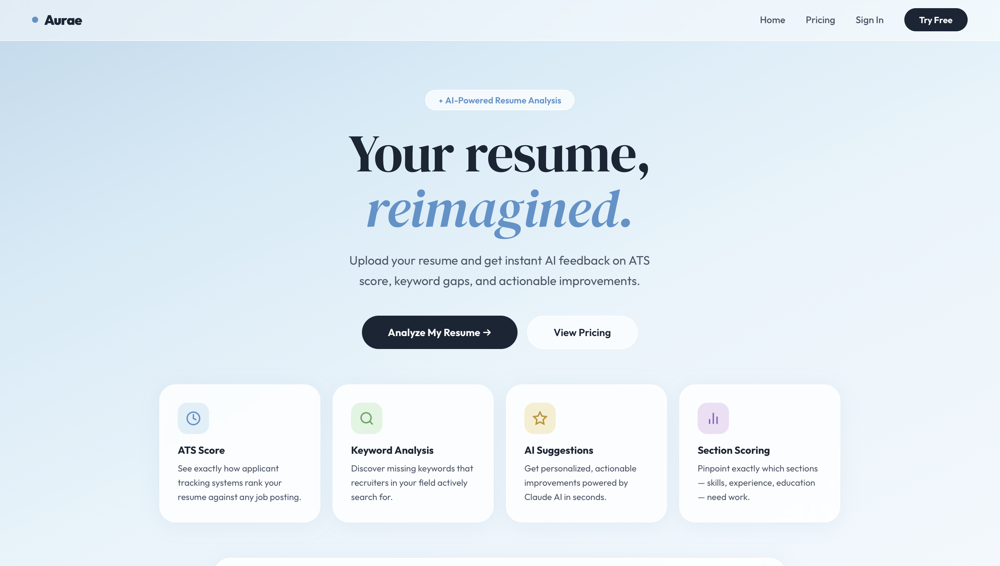

# Aurae — AI Resume Analyzer



A full-stack SaaS product built with **React + Vite**, **FastAPI**, **Firebase Auth**, and **Claude AI**.

---

## Tech Stack

| Layer     | Tech                                    |
|-----------|-----------------------------------------|
| Frontend  | React 18, Vite, React Router v6         |
| Backend   | FastAPI, Python 3.11+, pdfplumber       |
| AI        | Anthropic Claude (claude-opus-4-5)      |
| Auth      | Firebase Authentication                 |
| Deploy    | Vercel (frontend) + Railway (backend)   |

---

## Project Structure

```
aurae/
├── frontend/
│   ├── src/
│   │   ├── pages/          # Landing, Upload, Results, Pricing, Auth
│   │   ├── components/     # Navbar, ScoreRing, ProtectedRoute
│   │   ├── context/        # AuthContext (Firebase)
│   │   ├── lib/            # firebase.js, api.js (axios)
│   │   └── styles/         # global.css (sky aesthetic)
│   ├── .env.example
│   ├── vercel.json
│   └── package.json
│
└── backend/
    ├── main.py             # FastAPI app + CORS
    ├── routes/analyze.py   # POST /api/analyze, /api/analyze/text
    ├── services/
    │   ├── analyzer.py     # Claude API integration
    │   ├── parser.py       # pdfplumber PDF extraction
    │   └── auth.py         # Firebase Admin token verification
    ├── models/schemas.py   # Pydantic request/response models
    ├── requirements.txt
    ├── Procfile            # Railway deploy
    └── .env.example
```

---

## Local Setup

### 1. Clone & setup frontend

```bash
cd frontend
cp .env.example .env        # fill in Firebase + API URL
npm install
npm run dev                 # runs on http://localhost:5173
```

### 2. Setup backend

```bash
cd backend
python -m venv venv
source venv/bin/activate    # Windows: venv\Scripts\activate
pip install -r requirements.txt
cp .env.example .env        # fill in keys
uvicorn main:app --reload   # runs on http://localhost:8000
```

### 3. Firebase setup

1. Go to [Firebase Console](https://console.firebase.google.com)
2. Create a new project
3. Enable **Authentication** → Sign-in method → **Google** and **Email/Password**
4. Project Settings → Your Apps → Add Web App → copy config to `frontend/.env`
5. Project Settings → Service Accounts → Generate New Private Key → save as `backend/firebase_credentials.json`

### 4. Anthropic API key

1. Go to [console.anthropic.com](https://console.anthropic.com)
2. Create an API key → paste into `backend/.env` as `ANTHROPIC_API_KEY`

---

## Deployment

### Frontend → Vercel

```bash
cd frontend
npm run build
# Push to GitHub → connect repo on vercel.com
# Add all VITE_* env vars in Vercel dashboard
```

### Backend → Railway

```bash
# Push backend/ folder to a separate GitHub repo (or monorepo)
# Connect on railway.app → new project → Deploy from GitHub
# Add env vars: ANTHROPIC_API_KEY, FIREBASE_CREDENTIALS_PATH, ALLOWED_ORIGINS
# Upload firebase_credentials.json as a Railway secret file
```

---

## API Endpoints

| Method | Endpoint             | Description                     |
|--------|----------------------|---------------------------------|
| POST   | `/api/analyze`       | Analyze uploaded PDF/TXT file   |
| POST   | `/api/analyze/text`  | Analyze pasted resume text      |
| GET    | `/api/health`        | Health check                    |

---

## Environment Variables

### Frontend (`frontend/.env`)
```
VITE_FIREBASE_API_KEY=
VITE_FIREBASE_AUTH_DOMAIN=
VITE_FIREBASE_PROJECT_ID=
VITE_FIREBASE_STORAGE_BUCKET=
VITE_FIREBASE_MESSAGING_SENDER_ID=
VITE_FIREBASE_APP_ID=
VITE_API_URL=http://localhost:8000/api
```

### Backend (`backend/.env`)
```
ANTHROPIC_API_KEY=
FIREBASE_CREDENTIALS_PATH=firebase_credentials.json
PORT=8000
ALLOWED_ORIGINS=http://localhost:5173,https://your-app.vercel.app
```

---

Built by Arif Ali · [LinkedIn](https://www.linkedin.com/in/arif-ali-a705a8240) · [GitHub](https://github.com/iamarif-17)
